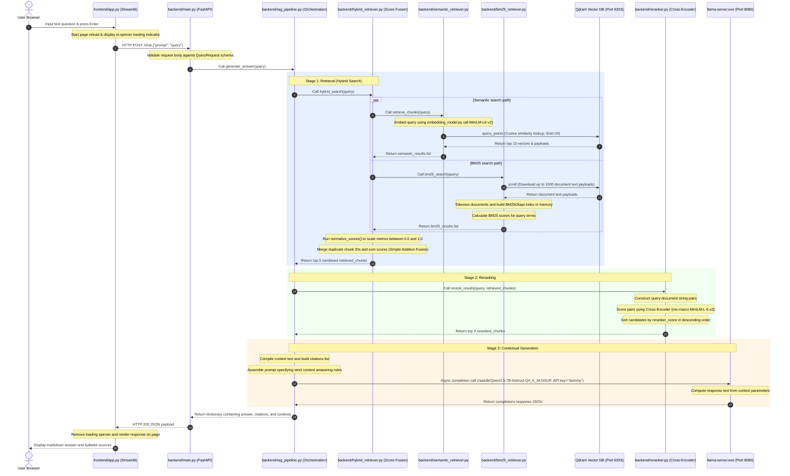

# Script Explanation: `16) project_flow.md`

## 1. Pipeline Flowchart
This diagram illustrates the files, components, and variables through which query data is transformed from user input to the final UI response.

```mermaid
flowchart TD
    subgraph Frontend [Streamlit UI: app.py]
        A[User Input String: query] -->│httpx POST payload│ B[API Payload: payload]
    end

    subgraph API [FastAPI Web Server: main.py]
        B -->│Request Validation│ C[Pydantic Object: request]
    end

    subgraph Pipeline [RAG Orchestration: rag_pipeline.py]
        C -->│Call generate_answer│ D[Orchestration Engine]
        
        subgraph Retrieval [Hybrid Search: hybrid_retriever.py]
            D -->│1. Call hybrid_search│ E[Search Coordinator]
            
            E -->│2a. retrieve_chunks│ F[semantic_retriever.py]
            F -->│Encode Query│ G[embedding_model.py]
            G -->│Cosine Search│ H[(Qdrant Database)]
            H -->│semantic_results│ I[Score Normalizer]
            
            E -->│2b. bm25_search│ J[bm25_retriever.py]
            J -->│Download Document Texts│ H
            J -->│Build Index & Score│ K[BM25Okapi Index]
            K -->│bm25_results│ I
            
            I -->│Min-Max Normalization│ L[Deduplication & Sum Fusion]
            L -->│final_results top 5│ M[retrieved_chunks]
        end
        
        subgraph Re-Scoring [Reranker: reranker.py]
            M -->│3. Call rerank_results│ N[Cross-Encoder Reranker]
            N -->│ms-marco-MiniLM model prediction│ O[reranked_chunks top 3]
        end
        
        O -->│4. Compile prompt & context│ P[Prompt String]
        
        subgraph Inference [Local Model Server: llama.cpp]
            P -->│5. Async API call using dummy API key│ Q[llama-server.exe]
            Q -->│Inference on Qwen 2.5 7B Q4 model│ R[Raw Answer Content]
        end
        
        R -->│6. Parse answer & citations dict│ S[Pipeline Output Result]
    end

    S -->│HTTP 200 JSON Response│ T[Streamlit Render Engine]
    T -->│Render UI elements│ U[Display Answer & Sources list]
```

---

## 2. Sequence Diagram
This chronological diagram illustrates the timeline lifecycle of a single user request and the interactions between subsystems.



---

## 3. Step-by-Step Execution Variable Trace Walkthrough

This section maps the chronological flow of a query variable state, detailing how data transforms from plain text to program structures, database queries, model responses, and UI elements.

#### Step 1: User Input
The user types the question `"What is overfitting?"` in the browser interface and hits enter. Streamlit captures this input and assigns:
* Variable: `query` (Type: `str`) = `"What is overfitting?"`
* *[Execution Context]*: This interaction occurs in the Streamlit frontend script **[app.py](file:///d:/projects/hybrid_rag%20-%20Copy/frontend/app.py)**.

#### Step 2: Serialization
The frontend packages the query and submits it as a POST request using the `httpx` client:
* Variable: `payload` (Type: `dict`) = `{"prompt": "What is overfitting?"}`
* *[Execution Context]*: The client encodes this dictionary into a JSON string and transmits it over HTTP to `http://localhost:8000/chat` using **[app.py](file:///d:/projects/hybrid_rag%20-%20Copy/frontend/app.py)**.

#### Step 3: API Endpoint Reception
The FastAPI server running on port 8000 receives the request at the `/chat` route:
* Variable: `request` (Type: `QueryRequest` model instance)
* *[Execution Context]*: Evaluated inside **[main.py](file:///d:/projects/hybrid_rag%20-%20Copy/backend/main.py)**. The server routes the request through its middleware pipeline.

#### Step 4: Schema Validation
Pydantic parses the payload. If the body contains `"prompt"`, it validates the type and maps it:
* Variable: `request.prompt` (Type: `str`) = `"What is overfitting?"`
* *[Execution Context]*: Enforced by the `QueryRequest` validation class in **[main.py](file:///d:/projects/hybrid_rag%20-%20Copy/backend/main.py)**.

#### Step 5: Orchestration Bootstrapping
The endpoint handler triggers the core RAG orchestration pipeline function:
* Function: `generate_answer(query="What is overfitting?")`
* *[Execution Context]*: Dispatched inside **[main.py](file:///d:/projects/hybrid_rag%20-%20Copy/backend/main.py)** and executed inside **[rag_pipeline.py](file:///d:/projects/hybrid_rag%20-%20Copy/backend/rag_pipeline.py)**, which uses the `@traceable` observer decorator to log latency and tokens.

#### Step 6: Query Embedding
To prepare for semantic vector similarity search, the query text is mapped to vector space:
* Variable: `query_vector` (Type: `list[float]`, length = 384) = `[0.0812, -0.0411, ..., 0.0253]`
* *[Execution Context]*: The query is embedded inside the function `retrieve_chunks()` located in **[semantic_retriever.py](file:///d:/projects/hybrid_rag%20-%20Copy/backend/semantic_retriever.py)**, using the model initialized in **[embedding_model.py](file:///d:/projects/hybrid_rag%20-%20Copy/backend/embedding_model.py)**.

#### Step 7: Dense Retrieval Search
The client submits the vector to the database to perform a nearest-neighbor query:
* Variable: `results` (Type: Qdrant query response points object)
* *[Execution Context]*: Queried inside **[semantic_retriever.py](file:///d:/projects/hybrid_rag%20-%20Copy/backend/semantic_retriever.py)**. The Qdrant engine performs cosine similarity searches on the `"rag_docs"` collection and returns the top 10 matches:
  * Variable: `semantic_results` (Type: `list[dict]`) = `[{"chunk_id": 1, "score": 0.95, ...}, {"chunk_id": 2, "score": 0.82, ...}, ...]`

#### Step 8: Lexical Search & Index Construction
Simultaneously, the keyword-based BM25 search path is executed:
* Variable: `points` (Type: Qdrant scroll response payload list)
* *[Execution Context]*: Executed inside **[bm25_retriever.py](file:///d:/projects/hybrid_rag%20-%20Copy/backend/bm25_retriever.py)**. The script scrolls the database to download up to 1,000 document texts, tokenizes them, constructs a `BM25Okapi` index in memory on the fly, scores the lowercase query words against the index, and returns the top 10 matches:
  * Variable: `bm25_results` (Type: `list[dict]`) = `[{"chunk_id": 1, "score": 8.5, ...}, {"chunk_id": 3, "score": 6.2, ...}, ...]`

#### Step 9: Score Normalization and Fusion
The raw score lists are normalized and fused to balance semantic and lexical scores:
* Variable: `combined_results` (Type: `dict` mapping chunk IDs to merged scores)
* *[Execution Context]*: Managed by the `hybrid_search()` function inside **[hybrid_retriever.py](file:///d:/projects/hybrid_rag%20-%20Copy/backend/hybrid_retriever.py)**. It runs `normalize_scores()`, checks for division-by-zero, maps results into a dictionary, merges duplicate chunk IDs (e.g., combining the semantic and BM25 scores for `chunk_id=1` to form a final score of `1.0 + 1.0 = 2.0`), sorts the combined list in descending order, and returns the top 5 candidates:
  * Variable: `retrieved_chunks` (Type: `list[dict]`) = `[{"chunk_id": 1, "final_score": 2.0, ...}, ...]`

#### Step 10: Candidate Reranking
The 5 hybrid candidates are re-scored to assess exact query-document context interaction:
* Variable: `scores` (Type: `numpy.ndarray` of logits) = `[3.85, -2.10, ...]`
* *[Execution Context]*: Orchestrated by `rerank_results()` in **[reranker.py](file:///d:/projects/hybrid_rag%20-%20Copy/backend/reranker.py)**. It constructs string pairs: `[["What is overfitting?", "Chunk text..."]]`, feeds them into the `ms-marco-MiniLM-L-6-v2` Cross-Encoder model, attaches the floats to the chunks, sorts them, and returns the top 3:
  * Variable: `reranked_chunks` (Type: `list[dict]`) = `[{"chunk_id": 1, "reranker_score": 3.85, ...}, ...]`

#### Step 11: Prompt Synthesis & Local LLM Call
The context texts are consolidated, citations are compiled, and the prompt is sent to the LLM:
* Variables:
  * `context` (Type: `str`) = `"Overfitting occurs when... \n\n Regularization helps..."`
  * `citations` (Type: `list[str]`) = `["concepts.txt"]` (after applying `set()` and `list()`).
  * `prompt` (Type: `str`) = `"You are a helpful assistant... Context: Overfitting occurs... Question: What is overfitting?"`
  * `response` (Type: OpenAI completion response object)
* *[Execution Context]*: Formatted inside **[rag_pipeline.py](file:///d:/projects/hybrid_rag%20-%20Copy/backend/rag_pipeline.py)**. The script sends the prompt asynchronously to the local model server (**[llama-server.exe](file:///d:/projects/hybrid_rag%20-%20Copy/backend/rag_pipeline.py#L9)**) running on port 8080. The quantized `Qwen 2.5 7B Q4` model performs local inference and generates the reply text:
  * Variable: `answer` (Type: `str`) = `"Overfitting is when a machine learning model memorizes training data..."`
