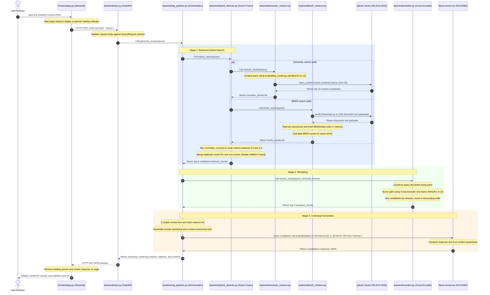

# Script Explanation: `16) project_flow.md`

## 1. Pipeline Flowchart
This diagram illustrates the files, components, and variables through which query data is transformed from user input to the final UI response.

```mermaid
flowchart TD
    subgraph Frontend [Streamlit UI: app.py]
        A[User Input String: query] -->│httpx POST payload│ B[API Payload: payload]
    end

    subgraph API [FastAPI Web Server: main.py]
        B -->│Request Validation│ C[Pydantic Object: request]
    end

    subgraph Pipeline [RAG Orchestration: rag_pipeline.py]
        C -->│Call generate_answer│ D[Orchestration Engine]
        
        subgraph Retrieval [Hybrid Search: hybrid_retriever.py]
            D -->│1. Call hybrid_search│ E[Search Coordinator]
            
            E -->│2a. retrieve_chunks│ F[semantic_retriever.py]
            F -->│Encode Query│ G[embedding_model.py]
            G -->│Cosine Search│ H[(Qdrant Database)]
            H -->│semantic_results│ I[Score Normalizer]
            
            E -->│2b. bm25_search│ J[bm25_retriever.py]
            J -->│Download Document Texts│ H
            J -->│Build Index & Score│ K[BM25Okapi Index]
            K -->│bm25_results│ I
            
            I -->│Min-Max Normalization│ L[Deduplication & Sum Fusion]
            L -->│final_results top 5│ M[retrieved_chunks]
        end
        
        subgraph Re-Scoring [Reranker: reranker.py]
            M -->│3. Call rerank_results│ N[Cross-Encoder Reranker]
            N -->│ms-marco-MiniLM model prediction│ O[reranked_chunks top 3]
        end
        
        O -->│4. Compile prompt & context│ P[Prompt String]
        
        subgraph Inference [Local Model Server: llama.cpp]
            P -->│5. Async API call using dummy API key│ Q[llama-server.exe]
            Q -->│Inference on Qwen 2.5 7B Q4 model│ R[Raw Answer Content]
        end
        
        R -->│6. Parse answer & citations dict│ S[Pipeline Output Result]
    end

    S -->│HTTP 200 JSON Response│ T[Streamlit Render Engine]
    T -->│Render UI elements│ U[Display Answer & Sources list]
```

---

## 2. Sequence Diagram
This chronological diagram illustrates the timeline lifecycle of a single user request and the interactions between subsystems.



---